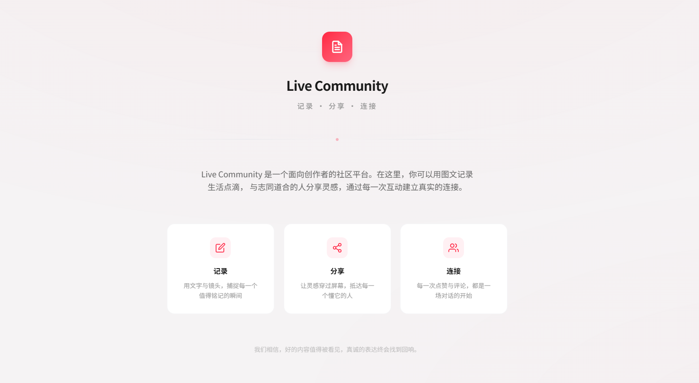
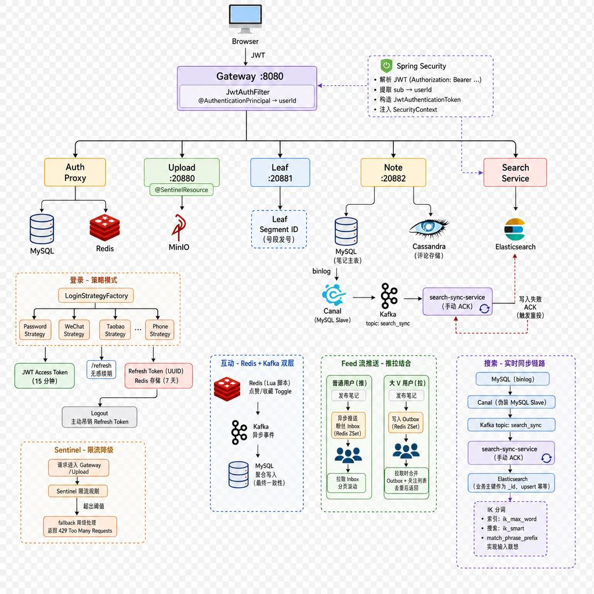
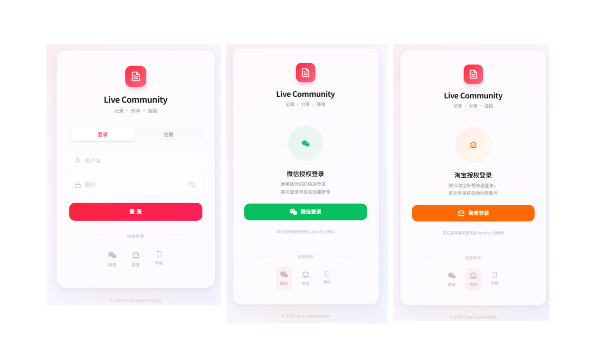
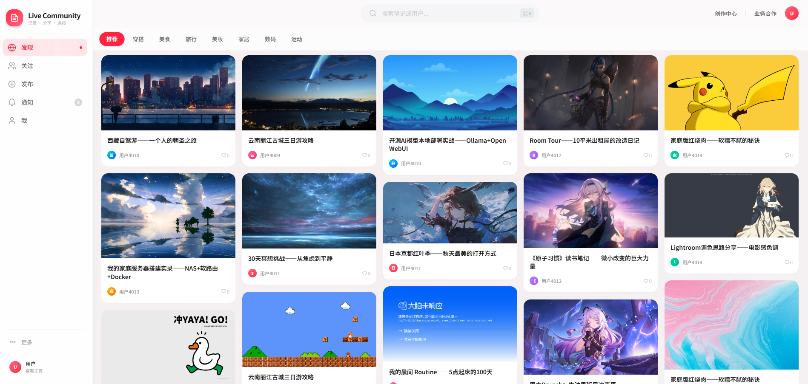
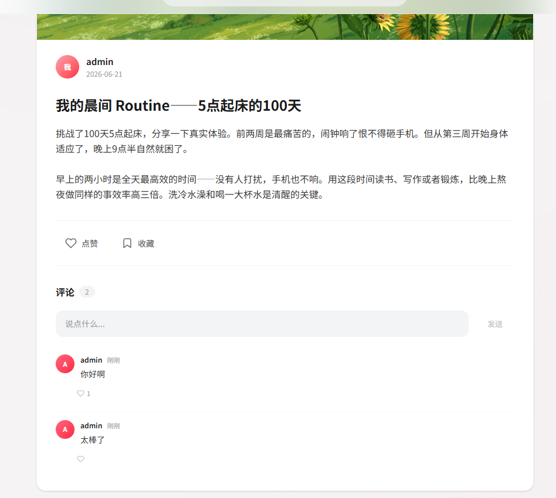
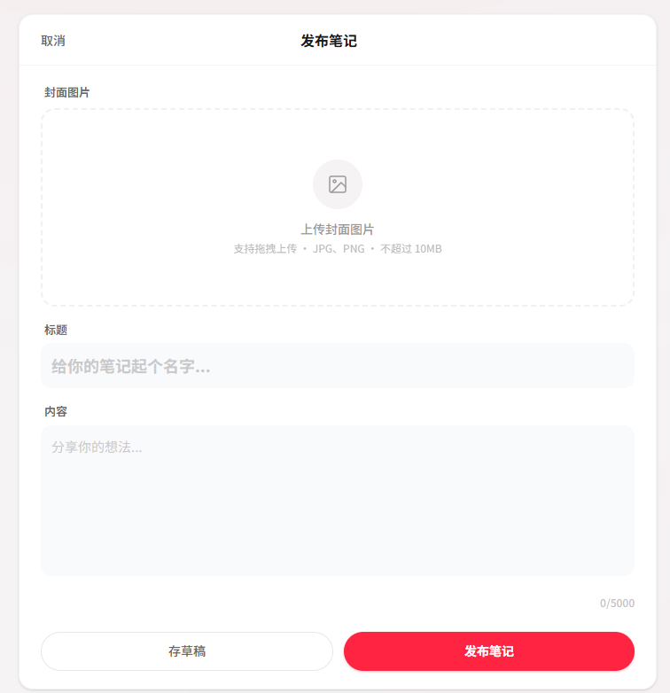
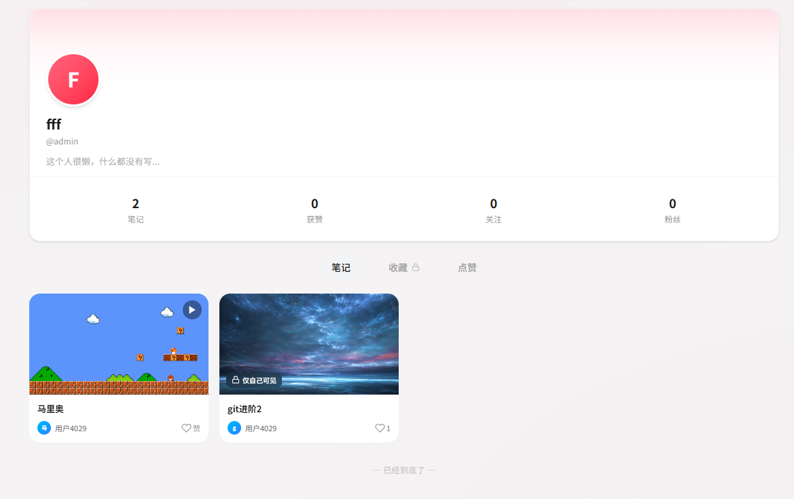
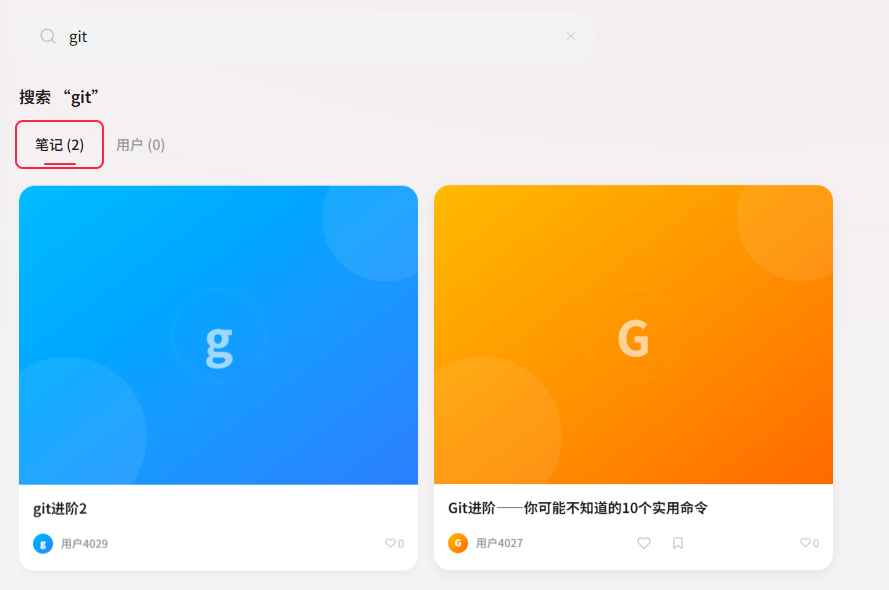
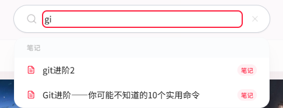
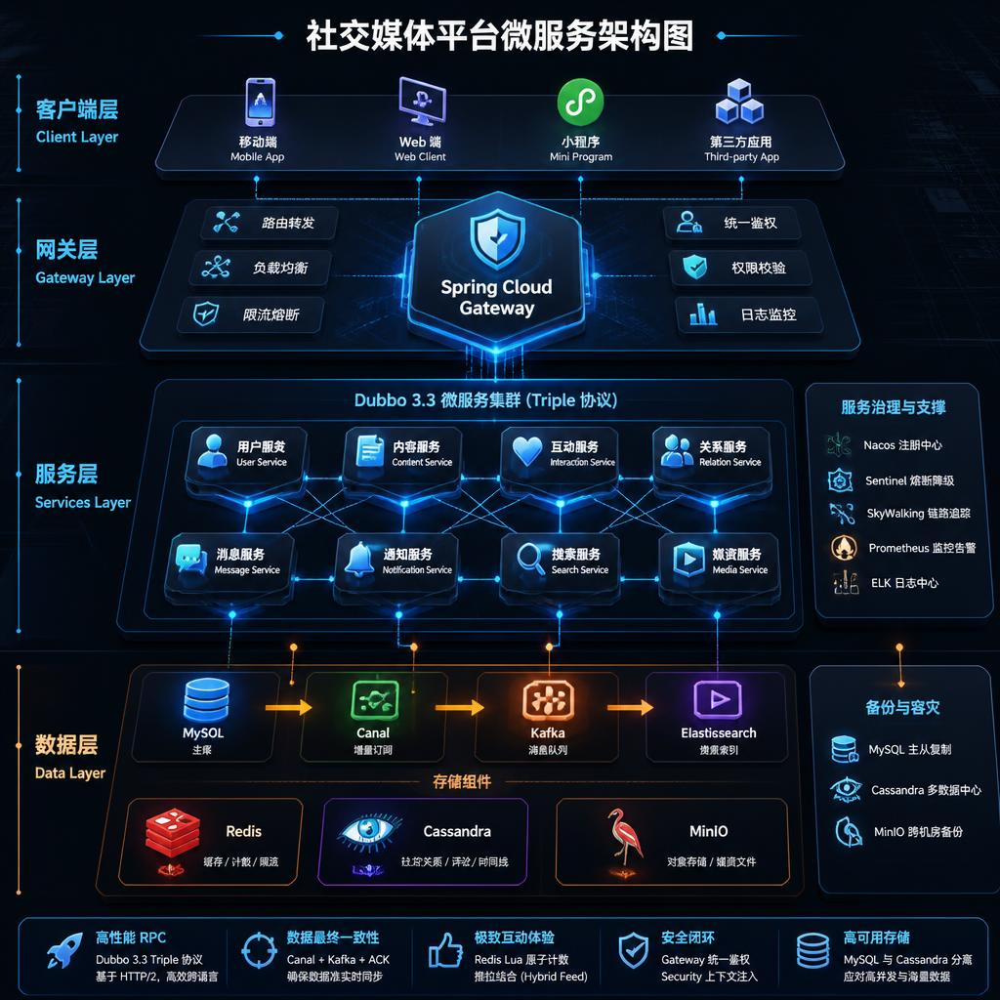

# live-community

高并发生活分享社区 — 笔记发布、点赞收藏、评论互动、全文搜索，基于 Spring Cloud Alibaba 微服务架构。


## 架构 



## 技术栈

| 层级 | 技术 |
|------|------|
| 框架 | Spring Boot 3.2 + Spring Cloud 2023.0.3 + Alibaba 2023.0.1 |
| RPC | Apache Dubbo 3.3 (Triple 协议 + Nacos 注册发现) |
| 服务治理 | Sentinel 限流降级 |
| 数据库 | MySQL 8.0 (用户/笔记主表) + Cassandra (评论/互动) |
| 缓存 | Redis 7 (Token 会话 + Lua 原子互动计数) |
| 消息队列 | Kafka 7.6 KRaft (搜索同步 + 互动聚合) |
| 对象存储 | MinIO 预签名 URL 直传 |
| 搜索引擎 | Elasticsearch 8.12 + IK 中文分词 |
| 数据同步 | Canal → Kafka → search-sync (手动 ACK) → ES |
| 分布式 ID | Meituan Leaf (号段 + 雪花算法) |
| 安全 | Spring Security + JWT 双 Token (access 15min / refresh 7d) |
| 前端 | React 18 + TypeScript + Tailwind CSS + Vite |

## 功能

| | |
|--|--|
| <br>**登录/注册** — 账号密码、手机验证码、微信 OAuth、淘宝 OAuth | <br>**Feed 流首页** — 分类 Tab + 瀑布流无限滚动笔记卡片 |
| <br>**笔记详情** — 图文详情 + 点赞/收藏 + 评论区 | <br>**发布笔记** — 标题 + 内容 + 封面图上传，存草稿或发布 |
| <br>**个人主页** — 用户信息 + 笔记 Tab（我的/收藏/点赞），支持编辑资料 |<br> **关注页** — 关注用户的笔记 Feed，瀑布流无限滚动 <br>|
| <br>**关键词搜索** —  按照笔记的点赞数 + 浏览数 + 评论数等计算 |<br> **联想功能** — 输入实时联想前缀匹配 <br>|


## 架构与实现要点

### Gateway — 统一入口

唯一 HTTP 入口。`JwtAuthFilter` 从 Authorization Header 提取 Bearer Token，解析 `sub` 字段得到 userId，构造 `JwtAuthenticationToken` 注入 `SecurityContext`。Controller 通过 `@AuthenticationPrincipal Long userId` 直接获取当前用户，无需手动解析 Token。

### 登录 — 策略模式

登录方式（密码 / 微信 / 淘宝 / 手机号）各自实现 `LoginStrategy` 接口，`LoginStrategyFactory` 根据 `type` 字段分发。JWT access token 有效期 15 分钟，refresh token 为 UUID 存 Redis（7 天），登出时主动吊销，`/refresh` 支持无感续期。

### 笔记 — 双存储

笔记主表存 MySQL，评论存 Cassandra（按 `note_id` 分区）。发布流程：创建草稿（Leaf 号段发号） → 发布时生成 MinIO 预签名 PUT URL → 前端直传图片 → 状态扭转为 `PUBLISHED`。详情查询使用 `CompletableFuture` 并行加载笔记和评论。

### 互动 — Redis + Kafka 双层

点赞/收藏通过 Redis Lua 脚本原子 toggle，同时发 Kafka 事件异步聚合写入 MySQL，兼顾热路径低延迟与最终一致性。Feed 流批量查询互动状态用一次 Lua `EVAL` 完成，避免 N+1 查询。

### Feed 流推送 — 推拉结合

采用推拉混合架构平衡写扩散与读扩散。普通用户发布笔记时异步推送至粉丝 Inbox（Redis ZSet 按时间排序），粉丝直接拉取个人收件箱即可。大 V 用户采用拉模式，仅写入自身 Outbox，粉丝拉取时实时合并 Outbox 与关注列表，避免名人写扩散风暴。Inbox/Outbox 以 ZSet 存储条目 ID 列表，支持分页滚动与去重。

### 搜索 — 实时同步链路

Canal 伪装 MySQL slave 消费 binlog，推送至 Kafka topic `search_sync`。`search-sync-service` 手动 ACK：ES 写入成功才确认，失败不 ACK 触发 Kafka 重投。ES 文档以业务主键作为 `_id`，upsert 天然幂等。IK 分词 `ik_max_word` 索引 / `ik_smart` 搜索，`match_phrase_prefix` 实现输入联想。

### Sentinel — 限流降级

Gateway 的 `UploadController` 标注 `@SentinelResource`，超出阈值走 fallback 返回 `429 Too Many Requests`，防止突发流量击穿下游。

## 快速开始

### 环境要求
JDK 17+ · Docker Desktop · Maven 3.6+ · Node 18+

### 1. 启动基础设施
```bash
docker compose up -d
```
等待所有容器 healthy（Nacos、MySQL、Cassandra、Redis、Kafka、MinIO、ES、Canal）。

### 2. 初始化
```bash
cd scripts && bash init-all.sh
```
注册 Nacos 配置 → 创建 ES 索引 (IK 分词) → 写入测试数据。

### 3. 启动后端
```bash
bash start-all.sh
```
按依赖顺序启动：leaf → upload → note → auth → search → search-sync → gateway。

```bash
# 或逐个模块启动
mvn -pl leaf-service spring-boot:run &
mvn -pl upload-service spring-boot:run &
mvn -pl note-service spring-boot:run &
mvn -pl auth-service spring-boot:run &
mvn -pl search-service spring-boot:run &
mvn -pl search-sync-service spring-boot:run &
mvn -pl gateway spring-boot:run &
```

### 4. 启动前端
```bash
cd front && npm install && npm run dev
```
浏览器打开 `http://localhost:5173`。

### 验证
```bash
curl -X POST http://localhost:8080/api/auth/login \
  -H 'Content-Type: application/json' \
  -d '{"username":"test","password":"123456"}'

curl http://localhost:8080/api/note/list

curl http://localhost:8080/api/search/note?q=美食
```


## vibe coding相关
## Skills
* [前端界面设计实现Skill](https://github.com/ConardLi/garden-skills/blob/main/skills/web-design-engineer)
* superpowers
* draw.io skill

## AI 工具
